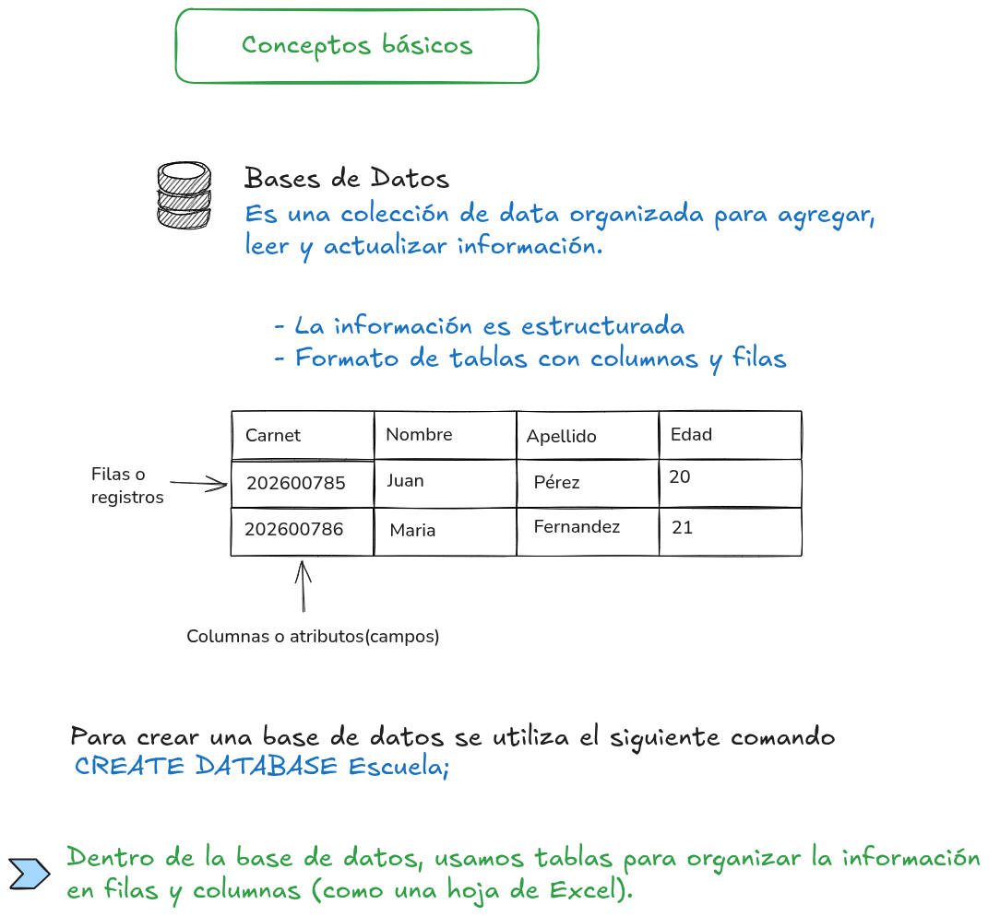

[REGRESAR](../README.md)  

# Tipos de datos comunes
  Los tipos de datos indican qué clase de información puede ir en cada columna:

    - INT → números enteros (ej. 15, 200).
    - VARCHAR(50) → texto de hasta 50 caracteres (ej. "Lorena").
    - DATE → fechas (ej. "2026-06-08").
    - DECIMAL(5,2) → números con decimales (ej. 123.45).

> Piensa en los tipos de datos como etiquetas que dicen “aquí solo van números” o “aquí solo va texto”.

[REGRESAR](../README.md)  